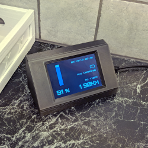
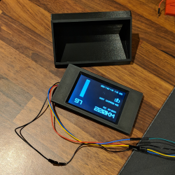
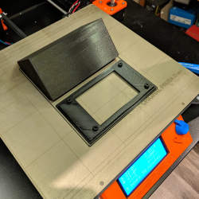
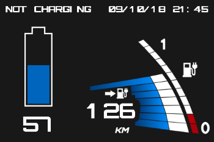
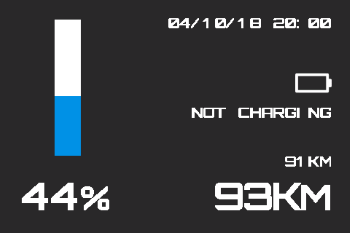

# leaf-display








## C# `LeafClient` library and console application

This repository contains a C# `LeafClient` class which can authenticate with and query data from Nissan Connect EV. There is also a cross platform console application that uses the `LeafClient` class to query data and optionally output the results as JSON to a file.

**Example data:**
```json
{
    "TimeStamp": "08/10/18 19:30",
    "BatteryCapacity": "240",
    "ChargingStatus": "NOT_CHARGING",
    "SoC": "48",
    "PluginState": "NOT_CONNECTED",
    "Range": "104000",
    "RangeAc": "103000",
    "ChargeTime": "10:30"
}
```

## IoT parts

### ESP8266 Arduino sketch
The `ESP8266` folder contains an Arduino skecth to retrieve JSON data from a web server and send it to a Nextion display over serial.

### Nextion display
The `Nextion` folder contains the HMI project for the display that shows the data. The Nextion display I used is the `NX4832T035_011` which is the 3.5" version.

### Nextion 3D-printable case
STL-files for the Nextion case can be found in the `Nextion Case` folder. The case is designed to be used with one of these [ESP programmers](https://www.ebay.com/itm/ESP-Series-Programmer-for-ESP8285-ESP8266-ESP32-ESP01-adapter-for-arduino/323127795519?hash=item4b3beadf3f:g:AdEAAOSwWmNaoWfZ), which makes it very easy to power and flash the ESP through micro USB. It also provides easy access to power and serial pins for the Nextion display.
